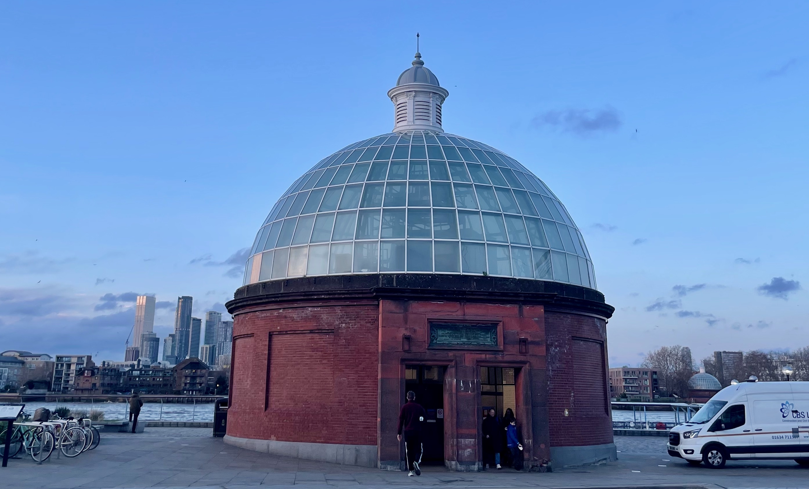
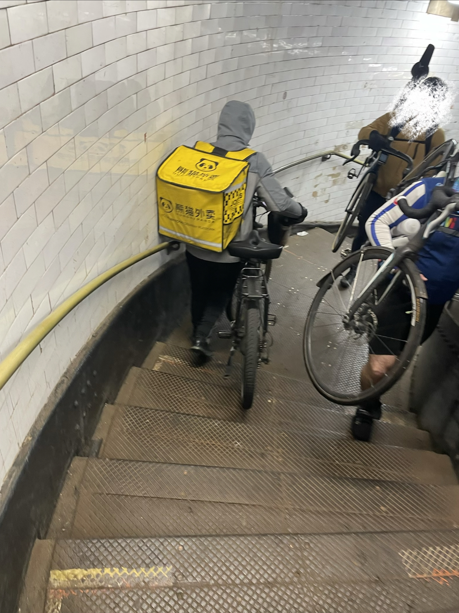
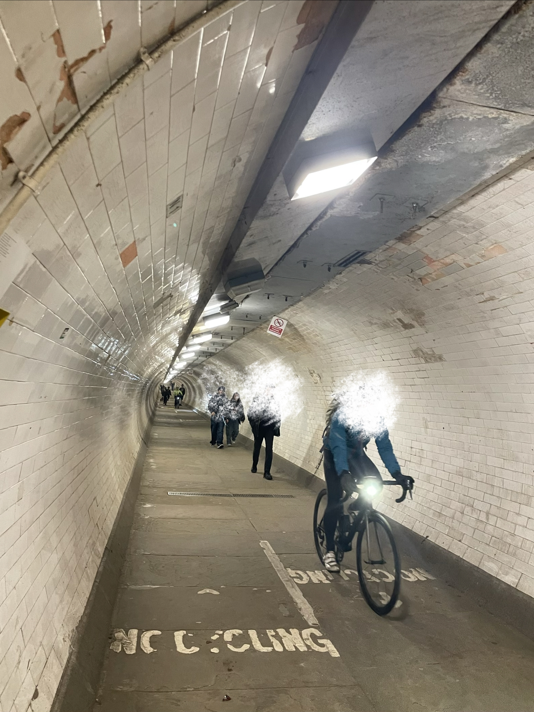

<h1 align="center"> Crossing the Gap：</h1>
<h2 align="center">Quantifying travel-time penalties for low-carbon modes at East London's Thames crossings </h2>

  

  <em>
  Figure 1. South entrance to the Greenwich Foot Tunnel.
  </em>

## Project Overview
On a weekday afternoon in Canary Wharf, a food delivery worker carries their bicycle down the stairs of the Greenwich Foot Tunnel. The lift has been broken for over a month. Inside, cyclists weave past pedestrians in a narrow, humid passage — the only direct active travel crossing between the Isle of Dogs and Greenwich Peninsula.

  
  

  <em>
  Figure 2. Cyclist carrying a bicycle up the tunnel stairs (left). Figure 3. Cyclist travelling through the tunnel (right).
  </em>

Three kilometres west, a driver slips through the Blackwall Tunnel in under four minutes.

This project asks a simple question: **how unequal is active travel crossing provision across London's River Thames, and what does that inequality cost the people who depend on it?**

## Research Questions
**RQ1 — Infrastructure inequality:**
How unequal is pedestrian and cycle crossing provision between East and West London?

**RQ2 — Time penalty:**
What travel-time penalties does this create, and who bears them?

## Methods Overview

| Step  | Method | Tools|
| ------------- | ------------- | ------------ |
| Network construction  | OSM road network filtered by mode using OSMnx  | Python, OSMnx  |
| Crossing inventory  | Bridge/tunnel tag extraction + Thames polygon spatial join  | Python, GeoPandas, PostGIS  |
| Crossing density (I1)  | Crossings per km of riverbank, East vs West  | Python, GeoPandas  |
| Detour factor (I2)  | Shortest-path walk vs car travel time, matched OD pairs  | Python, NetworkX|
| Closure penalty (I3)  | Re-routing with crossing edges removed from graph  | Python, NetworkX  |
| Generalised cost penalty (I4)  | Travel time converted to monetary cost using DfT WebTAG values of time, combined with fare data per crossing option  | Python  |
| Equity overlay (I5)  | Spatial join of penalty surface to LSOA IMD and car ownership  | Python, PostGIS  |

Active travel networks (walking and cycling) were constructed from the Greater London OSM dataset using OSMnx's built-in mode filters, retaining only the largest connected component. The River Thames polygon was extracted from the OSM multipolygon layer and used to clip bridge and tunnel-tagged edges to identify crossing candidates. All spatial operations use EPSG:27700 (British National Grid).

## Data Sources

| Dataset  | Source  | Notes  |
| --------- | --------- | --------- |
| OSM road network  | OpenStreetMap via OSMnx  | Walk, cycle, car networks  |
| River Thames polygon  | OSM Greater London extract  | Used for crossing intersection  |
| LSOA boundaries  | ONS Open Geography Portal  | 2021 Census boundaries  |
| Index of Multiple Deprivation  | MHCLG / ONS  | 2019 IMD by LSOA  |
| Car ownership  | Census 2021, ONS  | Households without a car by LSOA  |
| Public Transport Accessibility Level  | TfL / London Datastore  | PTAL scores by LSOA  |
| Population data  | Census 2021, ONS  | Population by LSOA  |

All data is publicly available from UK government and open data sources. No proprietary datasets were used.

## Key Findings

To be updated as analysis is completed.

## Maps

Maps

To be added on completion.

